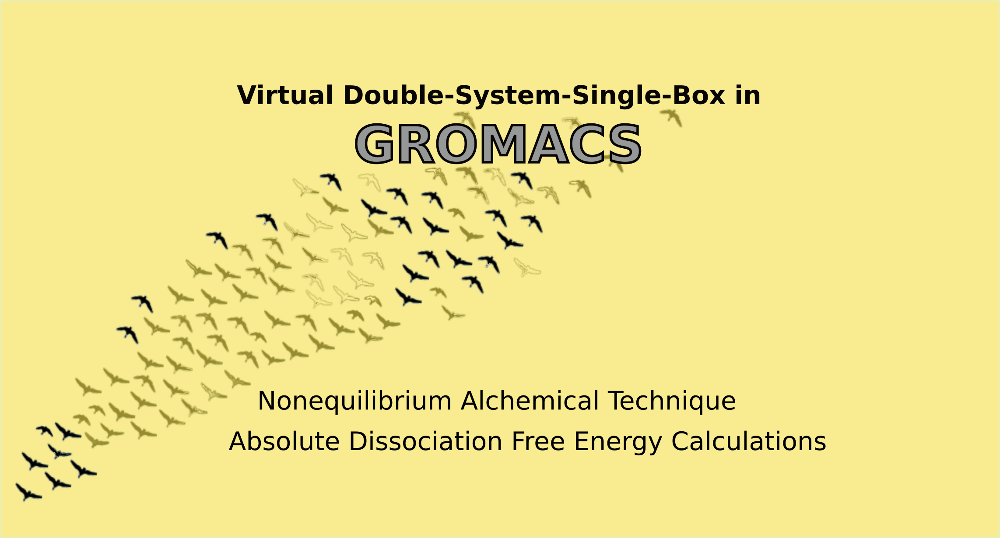

# Absolute Dissociation  Free Energy calculations on HPCs: vDSSB tutorial for GROMACS users  

 
  

 This is a tutorial for the calculation of absolute dissociation free energy between PF-07321332 and 3CLpro.
The methodology is divided into six consecutive steps. For each step, we report the computational details. The major massively parallel computational step consists in the HREM simulations (Step 3) and in fast switching alchemical simulations (Step 5). The Steps 1, 2 and 4 are fast preparatory automatized procedures for running the two major computational jobs on the HPC, Step 3 and Step 5.  The last Step 6 is the automatized post-processing of the vDSSB data. A description of the procedure can be find in the paper .....  Full output data for the application PF-07321332-3CLpro can be found on the Zenodo repository (<a href="https://zenodo.org/record/5139374"> https://zenodo.org/record/5139374 </a>).
 
<a href="step1.html"> Step 1 </a>: Docking (<b>local</b>)  
<a href="step2.html"> Step 2 </a>: Running <a href="https://github.com/MauriceKarrenbrock/HPC_Drug"> HPC_drug <a/> for HREM set-up (<b>local</b>)  
<a href="step3.html" style="color:#3f992e;"> Step 3 </a>: HREM simulations (<b>HPC</b>)   
<a href="step4.html"> Step 4 </a>: Selection of the (enhanced sampled) configurations (<b>HPC</b>)  
<a href="step5.html" style="color:##3f992e;"> Step 5 </a>:  Fast Switching Alchemical Simulations (<b>HPC</b>) 
<a href="step6.html"> Step 6 </a>:   Calculation of dissociation free energy (<b>HPC/local</b>) 

 Marina Macchiagodena, Maurice Karrenbrock, Marco Pagliai, Piero Procacci  
 Dipartimento di Chimica "Ugo Schiff", Università degli Studi di Firenze, Via della Lastruccia 3, 50019 Sesto Fiorentino, Italy  
 If you have any questions, please feel free to contact the <a href = "mailto: piero.procacci@unifi.it">authors</a>.
  
  
